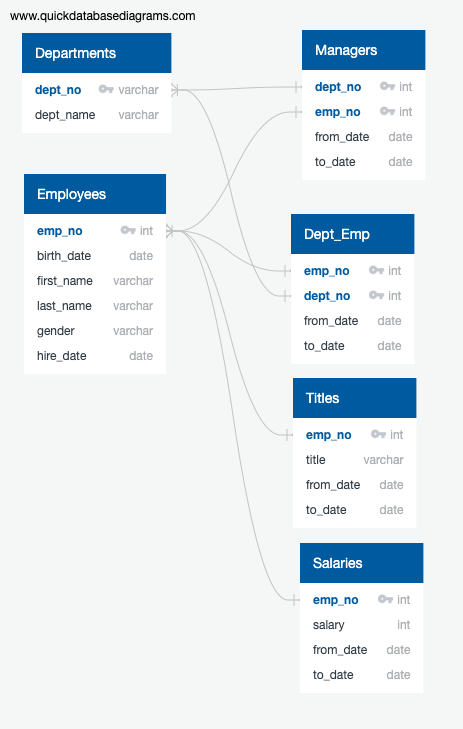

# Chrissy Cho's Pewlett-Hackard-Analysis
### Table of Contents
[ 1. Project Overview ](#desc)  
[ 2. Resources ](#resc)  
[ 3. Objectives ](#obj)  
[ 4. Summary ](#sum)  
[ 5. Challenge Overview ](#chal)  
[ 6. Challenge Summary ](#chalsum)  

## Project Overview
In this module, we learned to explore databases with SQL. Throughout the module, we learned to build
an employee database with SQL by applying data modeling, engineering, and analysis. For data modeling, we created
entity relationship diagrams (ERDs). For data engineering, we created a database in Postgresql using GUI(pgAdmin), where we imported data and organized them into tables. We then created queries to perform analysis to determine specific conditions
for a hypothetical company, "Pewlett-Hackard." 

## Resources
- Data Source: [departments.csv](https://github.com/chrissycho/Pewlett-Hackard-Analysis/blob/master/Data/departments.csv), [dept_emp.csv](https://github.com/chrissycho/Pewlett-Hackard-Analysis/blob/master/Data/dept_emp.csv), [dept_manager.csv](https://github.com/chrissycho/Pewlett-Hackard-Analysis/blob/master/Data/dept_manager.csv), [employees.csv](https://github.com/chrissycho/Pewlett-Hackard-Analysis/blob/master/Data/employees.csv), [salaries.csv](https://github.com/chrissycho/Pewlett-Hackard-Analysis/blob/master/Data/salaries.csv), [titles.csv](https://github.com/chrissycho/Pewlett-Hackard-Analysis/blob/master/Data/titles.csv)
- Software: [PostgreSQL version 12.3](https://www.enterprisedb.com/downloads/postgres-postgresql-downloads), [pgAdmin](https://www.postgresql.org/ftp/pgadmin/pgadmin4/v4.23/macos/)
- More Information: [PostgreSQL documnetation](https://www.postgresql.org/docs/manuals/), [pgAdmin documentation](https://www.pgadmin.org/docs/)

## Objectives
- Data Modeling: identify data relationships, determine entity relationships, create ERDs using [Quick Database Diagram tools](https://www.quickdatabasediagrams.com/)
- Data Engineering: create a database, create tables in SQL, import data, troubleshoot imports (errors)
- Data Analysis: perform conditional queries, join the tables, use count, groupby, and orderby, create additional lists, create a tailored list

## Summary
By using Quick Database Diagram tools, we were able to identify entity relationships and create entity relationship diagrams (ERDs or schemas). 
### ERD

There are three parts of ERD: 1) conceptual diagram (the simplest form with table name and column headers), 2) logical form (conceptual diagram plus data types, primary and foreign keys), 3) physical form (physical relationships between tables). Based on the entity relationships, we can then create
tables with actual data in the postgresql and pgAdmin. On pgAdmin, we will be able to input queries to create a database to hold information of our interest. 

Throughout the module, we have created following tables (csv files):

1)	Retirement eligible screening 
- birth date from 1952-1955 and hired from 1985 to 1988
- new table: [retirement_info](https://github.com/chrissycho/Pewlett-Hackard-Analysis/blob/master/Data/retirement_info.csv)

2)	Current Employees who will be leaving (already filtered with bday & hiring date) 
- join retirement_info and dept_employees 
- add conditional statement de.to_date = (‘9999-01-01’) to select those who are still working 
- new table: [current_emp](https://github.com/chrissycho/Pewlett-Hackard-Analysis/blob/master/Data/current_emp.csv)

3)	Employee by departments (how many are leaving by each dept)
- new table current_emp and dept_employees
- group by de.dept_no and order by de.dept_no
- new table: [emp_ri](https://github.com/chrissycho/Pewlett-Hackard-Analysis/blob/master/Data/emp_ri.csv)

4)	Employee info who’s leaving
- join employees, salaries, dept_employees
- emp_no, names, gender (all from employees table), salary (from salary table), to_date (dept_employees) 
- Conditional statements on e.birth_date, e.hire_date and de.to_date
(Using WHERE, BETWEEN, AND) 
- new table: [emp_info](https://github.com/chrissycho/Pewlett-Hackard-Analysis/blob/master/Data/emp_info.csv)

5)	Managers info who’s leaving from each department
- join dept_manager, departments, current_emp tables
- dept_no (with dept_manager & departments) 
- emp_no (with dept_manager & current_emp)
- new table: [manager_info](https://github.com/chrissycho/Pewlett-Hackard-Analysis/blob/master/Data/manager_info.csv)

6)	Department Retirees
- who are leaving and what department
- join current_emp, dept_emp, departments
- join departments with de.dept_no = d.dept_no while ce.emp)no = de.emp_no
- Will see some emp. appearing twice
- new table: [dept_info](https://github.com/chrissycho/Pewlett-Hackard-Analysis/blob/master/Data/dept_info.csv)

7)	Sales department retirees
- join current_emp, dept_emp, departments
- condition where de.dept_no. = ‘d007’ will return Sales department only with the current employees who are eligible for retirement 
- new table: [sales_info](https://github.com/chrissycho/Pewlett-Hackard-Analysis/blob/master/Data/sales_info.csv)

8)	Retirees from both Sales & Department
- join current_emp, dept_employees, departments (d)
- join ce.emp_no & de.emp_no; de.dept_no & d.dept_no 
- new table: [emp_sales_dept](https://github.com/chrissycho/Pewlett-Hackard-Analysis/blob/master/Data/emp_sales_dept.csv)

## Challenge Overview
Based on the module, we performed two additional analyses: 1) Number of Retiring Employees by Title, 2) Mentorship Eligibility.

## Challenge Summary
[challenge quries](https://github.com/chrissycho/Pewlett-Hackard-Analysis/blob/master/Challenge/challenge.sql)
1. Technical Analysis Deliverable 1:
We were instructed to find employees who were born between 1952-1955, grouped by job title. 
We wanted employee number, first & last name, title, from_date, and salary in a table. 
Since we already screened out employees who are eligible for retirement during the module. We will select columns from the current_emp table (see #2 above). 

- Number of Retiring Employees by Title
    - [emp_title](https://github.com/chrissycho/Pewlett-Hackard-Analysis/blob/master/Challenge/emp_title.csv)
    - We selected employee number, first and last name from current_emp table, title and from_date from title table, and salary from the salary table.
    - We joined current_emp table with titles table and salaries table. 
   
    - One problem we noticed with the emp_title table is that we had duplicates of employee number because they might have changed their titles in between. Thus, we had to perform a query to partition the data to show only most recent title per employee. 

- Most recent title per retiring employee
    - To solve the aforementioned problem, we had to remove duplicate using partitioning data. 
    - The following code is: 
    - We pulled the information from the emp_title table and removed the duplicate to have a table like this:
    
    - [rent_ti](https://github.com/chrissycho/Pewlett-Hackard-Analysis/blob/master/Challenge/recent_ti.csv)

- Number of retirees by each title (Only accounted for recent title)
    - We also printed out the number of employees who are eligible to retire by each title. 
      
    - [emp_title_number](https://github.com/chrissycho/Pewlett-Hackard-Analysis/blob/master/Challenge/emp_title_number.csv)

2.  Technical Analysis Deliverable 2:
For the second additional analysis, we were instructed to find out employees who are eligible to participate in the mentorship program. The age criteria was from Jan. 1, 1965 to Dec. 31, 1965. 
- Employees who are eligible for mentorship program
    - To create a table for these employees, we used two inner joins. We printed employee number, first & last name, their titles and from_date and to_date of their employment. 
    - We joined employees table with dept_employees and titles tables, making conditional statements on their birth date and their current employment (to_date).
     
    ### result
    
    - [emp_mentorship](https://github.com/chrissycho/Pewlett-Hackard-Analysis/blob/master/Challenge/emp_mentorship.csv)
    - However, this table has duplicates of employees not accounting for the recent title. Therefore, I had to perform another pertition to have recent titles only. 
     
    ### result
    

3. Limitation of the analyses:
Throughout the challenge, there were a couple of things I wanted clarifications on. First, the instruction didn't specify whether we need to define the hire date, but I included the hire date because it's a part of retirement eligibility (based on the module) by using the current_emp table. Second, we could use the title's to_date by joining one table instead of two tables (dept_employee table and titles' table) in deliverable 2. We removed the duplicates in the third table by partitioning the table. 